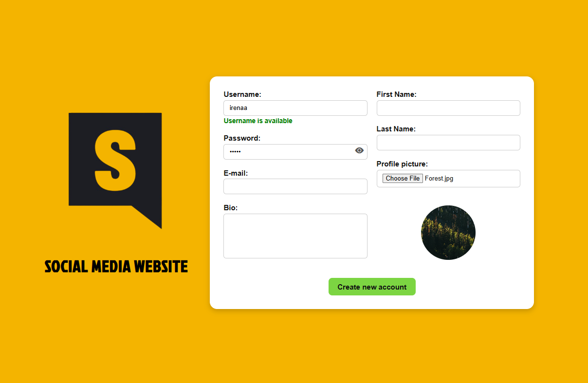
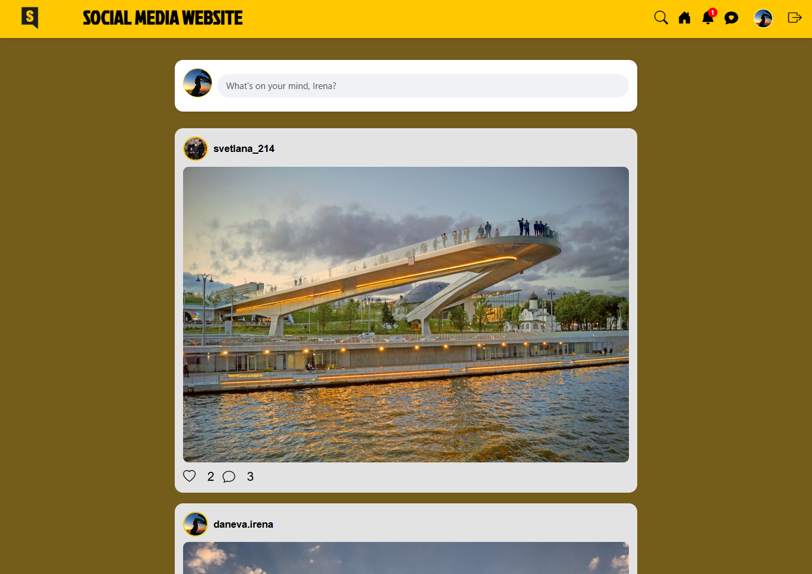
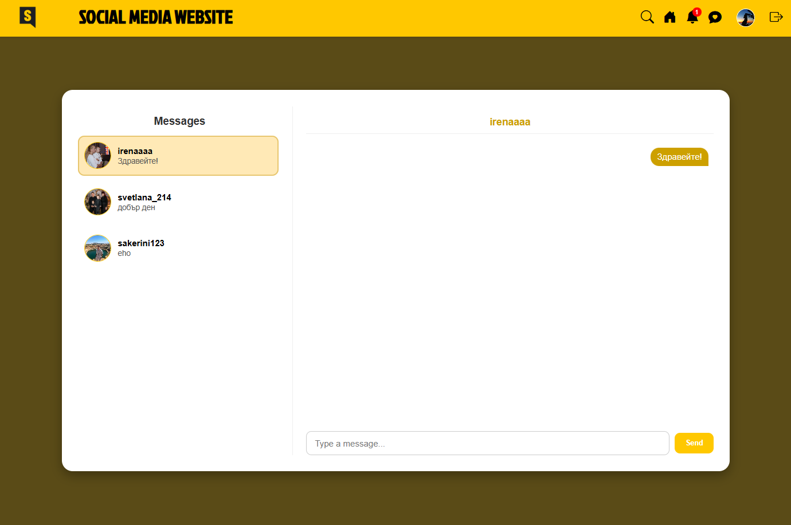
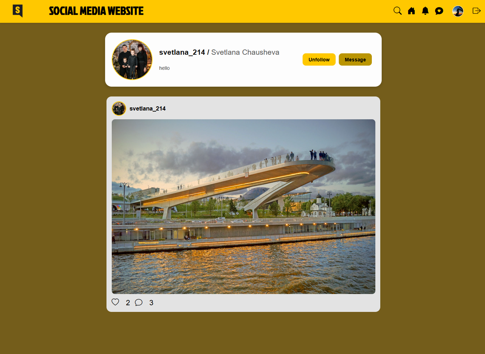
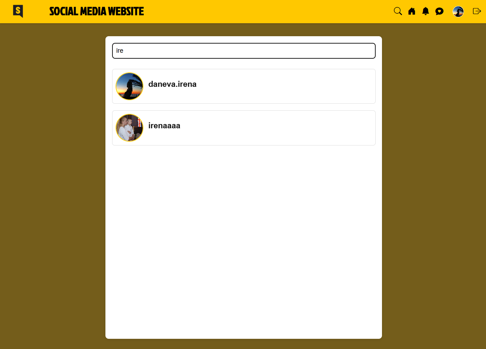
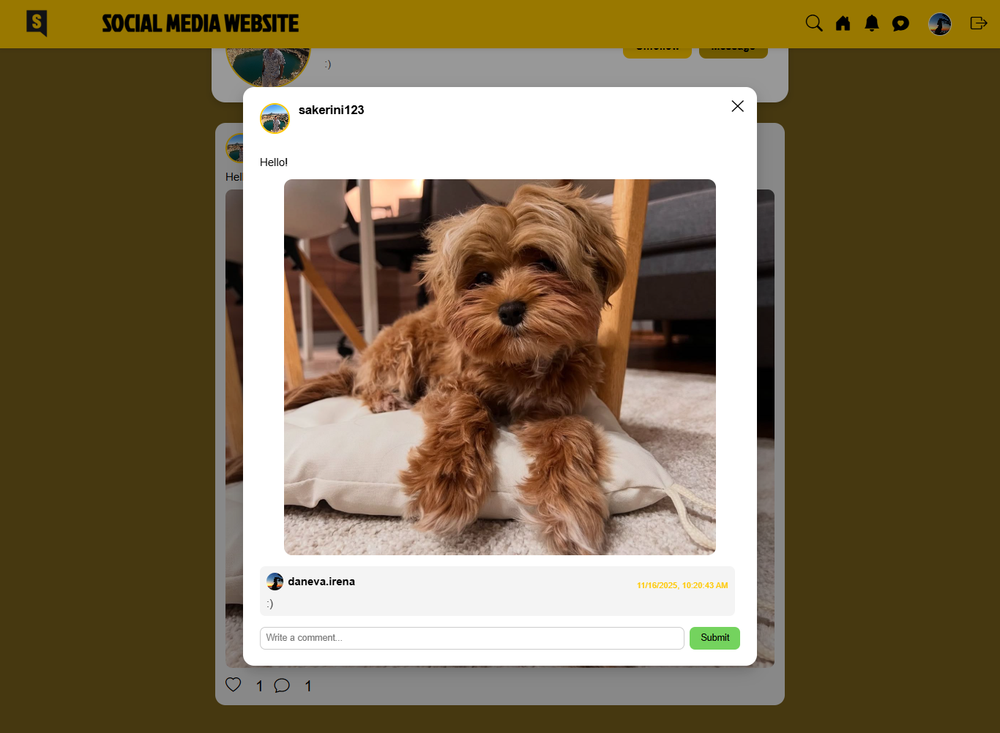
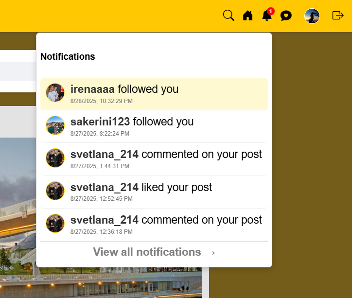
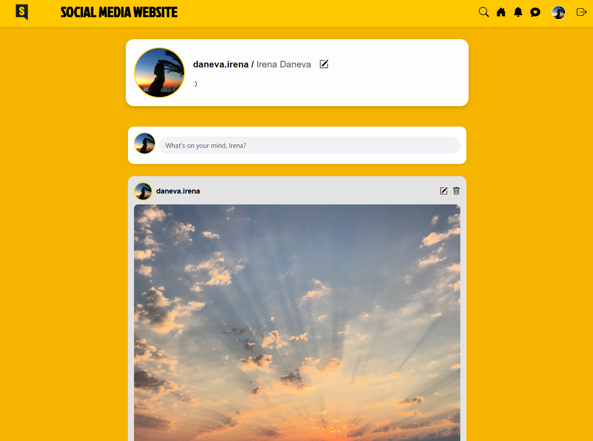

# Social Media App — Frontend  
A modern, responsive social media web application built with **React**, providing a clean UI and smooth user experience.  
This is the **frontend** of a full-stack project that includes authentication, posting, commenting, chat, notifications, and more.

🔗 **Backend Repository:**  
https://github.com/danevairena/SocialMediaBackend

---

## Features

### 🔐 Authentication
- Register a new account  
- Login with validation  
- Protected routes  
- Logout  

### 📰 Feed
- View posts from followed users  
- Like / Unlike posts   
- View comments modal
- Comment on posts 

### 👤 Profile
- View your profile
- Edit your profile 
- View other users' profiles  

### ➕ Posts
- Create a post with image upload
- Edit your posts
- Delete your posts  

### 💬 Messaging
- Real-time chat between users  
- Conversation view  
- Message input and history  

### 🔔 Notifications
- Like notifications  
- Comment notifications  
- Follow notifications  

### 👥 Search & Follow System
- Search for users  
- Follow / Unfollow  

---

## Screenshots

### 🔐 Login


### 📝 Register


### 📰 Feed


### 💬 Messages


### 👤 User Profile


### 🔍 Search


### 🗨️ Comments


### 🔔 Notifications


### 👩‍💻 Me (Profile)


---

## 🛠️ Tech Stack

### 🎨 Frontend
- **React**
- **React Router**
- **Context API**
- **Axios**
- **CSS Modules**

### 🔌 Communication
- REST API  
- Axios HTTP client  

---

## 📁 Folder Structure
```
src/
 ├── api/
 ├── assets/
 ├── components/
 ├── contexts/
 ├── pages/
 ├── styles/
 └── App.jsx
```

---

## 🔧 Installation & Run

### 1️⃣ Clone the repository
```bash
git clone https://github.com/danevairena/SocialMediaFrontend.git
```

### 2️⃣ Install dependencies
```bash
npm install
```

### 3️⃣ Start the development server
```bash
npm run dev
```

---

## 🔗 Backend API
Full backend code, database schema and REST API documentation:  
👉 **https://github.com/danevairena/SocialMediaBackend**
